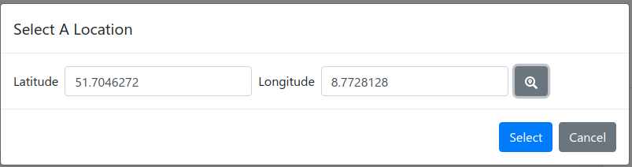

# OPAL Web User Interface

This component provides the main user interface.
It mainly builds on [React](https://reactjs.org/) and [Next.js](https://nextjs.org/) - a JavaScript library and a framework for building user interfaces.

The OPAL Web User Interface is part of the [OPAL demo component](https://github.com/projekt-opal/demo).
It requires a running [OPAL webservice](https://github.com/projekt-opal/web-service), which provides the data to display.

## Integrated: City App Demonstrator 

For OPAL deliverable D7.3, a mobile app was integrated to the OPAL user interface. It supports users in identifying data at their current locations.

The demonstrator was implemented by a web-app using Responsive web design (RWD).
The required user geo information is requested via the `navigator.geolocation.getCurrentPosition` function specified by W3C [GeoApi, Position].
The functionality was added using an integrated table sorting [OrderBy].

* [GeoApi] [W3C Geolocation API Specification](https://w3c.github.io/geolocation-api/)
* [Position] [OrderBy.js:96](src/components/report/datasets/dataset/OrderBy.js#L96)
* [OrderBy] [OrderBy.js:79](src/components/report/datasets/dataset/OrderBy.js#L79)

## Notes

- Development notes are in the [wiki](https://github.com/projekt-opal/web-ui).

## Credits

[Data Science Group (DICE)](https://dice-research.org/) at [Paderborn University](https://www.uni-paderborn.de/)

This work has been supported by the German Federal Ministry of Transport and Digital Infrastructure (BMVI) in the project [Open Data Portal Germany (OPAL)](http://projekt-opal.de/) (funding code 19F2028A).
  
